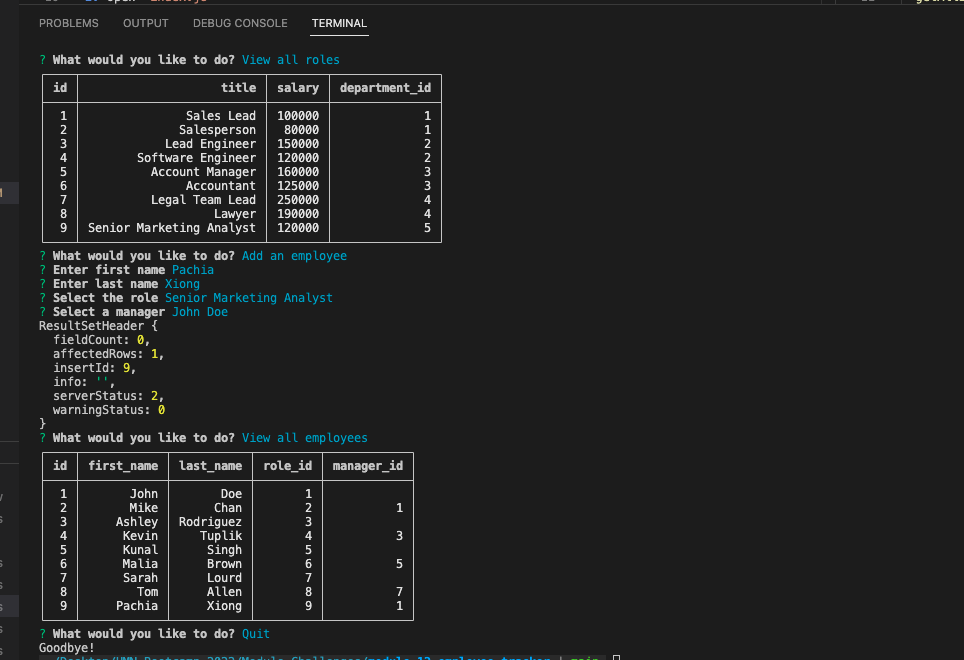

# module-12-employee-tracker

## Overview

As a business owner, I created a databse to view all departments, roles and employees in my company. I am able to add new departments, roles, or employees.

## Installation:

1. `git clone git@github.com:PDKetchum/module-12-employee-tracker.git`
2. Open `index.js`

## How to use:

In terminal

1. Create `.env` file and enter mysql credentials with `DB_NAME` set as "`company_db`"
2. `npm install`
3. `node index.js`
4. Answer prompts

GitHub URL: https://github.com/PDKetchum/module-12-employee-tracker

## Credits:

_Screenshot of page_
